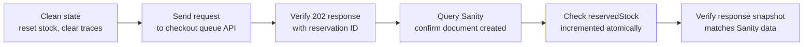

```mermaid
flowchart LR
    Clean[Clean state<br/>reset stock, clear traces] --> Request[Send request<br/>to checkout queue API]
    Request --> Response[Verify 202 response<br/>with reservation ID]
    Response --> Sanity[Query Sanity<br/>confirm document created]
    Sanity --> Stock[Check reservedStock<br/>incremented atomically]
    Stock --> Snapshot[Verify response snapshot<br/>matches Sanity data]
```
